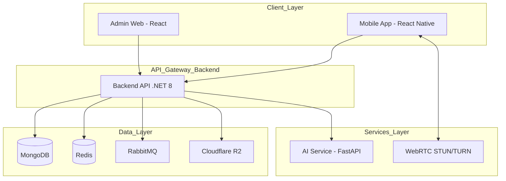

# 📋 Project Summary: Dating App & Scam Detection System

## 1. Tổng quan Dự án (Project Overview)
Hệ thống ghép đôi người dùng tích hợp mô hình học máy để phát hiện tài khoản lừa đảo. Người dùng được đánh giá liên tục dựa trên hành vi và thông tin xác thực danh tính (Face Identity).
- **Tên dự án:** DATN2026-STT43
- **Base URL:** `https://datn.chessy.dev`
- **Mục tiêu:** Cung cấp nền tảng hẹn hò an toàn, minh bạch với sự hỗ trợ của AI trong việc nhận diện người dùng thật và ngăn chặn các hành vi gian lận.

---

## 2. Kiến trúc Hệ thống (System Architecture)

### 2.1. Sơ đồ tổng quát
Hệ thống tuân thủ mô hình **Client-Server** với kiến trúc **Clean Architecture** ở Backend và **Microservices** nhẹ cho AI.

### 2.2. Chi tiết các lớp Backend (Clean Architecture)
- **Domain Layer:** Chứa các thực thể cốt lõi (Entities), Value Objects và các interface Repository. Không phụ thuộc vào bất kỳ thư viện bên ngoài nào.
- **Application Layer:** Chứa Logic nghiệp vụ (Use Cases), DTOs, Mapping logic và các trình xử lý Command/Query (CQRS).
- **Infrastructure Layer:** Triển khai các interface từ Domain như MongoDB Repository, Redis Cache, MailKit Service, và Firebase Notification.
- **Web API Layer:** Các Controllers xử lý request/response, Middlewares xử lý JWT, Exception và Validation.

---

## 3. Tech Stack Chi tiết

### 🖥️ Backend (C# .NET 8)
- **Framework:** ASP.NET Core 8.0 (Web API).
- **Cơ sở dữ liệu:** 
  - **MongoDB:** Lưu trữ dữ liệu chính với Geo-spatial Index để hỗ trợ tìm kiếm người dùng theo vị trí.
  - **Redis:** Lưu trữ dữ liệu tạm thời (OTP, Session) và Rate limiting cho hệ thống Swipe.
- **Giao tiếp Real-time:** SignalR (WebSockets) cho tin nhắn và Signaling WebRTC.
- **Lưu trữ file:** Cloudflare R2 (S3 API) giúp lưu trữ ảnh người dùng và tài liệu xác thực một cách tối ưu.

### 📱 Mobile (React Native - Expo)
- **Framework:** Expo 54 + React Native 0.81.
- **Quản lý trạng thái:** `Zustand` cho các global states nhẹ và `React Query` cho việc đồng bộ dữ liệu server.
- **UI:** Tailwind CSS (NativeWind), Reanimated 3 (cho hiệu ứng quẹt thẻ mượt mà).

---

## 6. Cơ sở lý thuyết & Mô hình đề xuất (Deep Dive)

### 6.1. Chi tiết kiến trúc MiniFASNet V2 SE
Mô hình bao gồm các giai đoạn (stages) xử lý đặc trưng từ thô đến tinh:
- **Early Layers:** Hai lớp Convolution đầu tiên sử dụng 3x3 kernel với stride 2 giúp giảm độ phân giải ngay lập tức (128x128 -> 64x64), giảm tải tính toán.
- **Stage 1 (32x32):** 4 khối Residual với kết nối tắt (Skip connection). Một khối SE (Squeeze-and-Excitation) được đặt cuối stage để tái trọng số các kênh đặc trưng.
- **Stage 2 (16x16):** 6 khối Residual. Đây là stage quan trọng nhất vì là nơi các đặc trưng về kết cấu (texture) của da người và vật liệu giả mạo (màn hình, giấy) thể hiện rõ nhất.
- **Stage 3 (8x8):** 2 khối Residual cuối cùng trước khi chuyển qua Global Average Pooling.
- **Classifier Head:** Gồm 2 lớp Fully Connected (FC) với Dropout tỷ lệ cao (0.75) để chống Overfitting - một hiện tượng cực kỳ phổ biến trong bài toán Anti-spoofing do tập dữ liệu huấn luyện khó bao phủ hết các loại vật liệu giả mạo trong thực tế.

### 6.2. Cơ chế Fourier Transform Auxiliary Loss
- **Lý thuyết:** Ảnh giả mạo (Replay/Print) thường chứa các nhiễu tần số cao (Moire patterns, halftone dots). Ảnh thật có phổ tần số mượt mà hơn.
- **Thực hiện:** Một nhánh phụ (FT branch) lấy input từ Stage 2, qua 3 lớp Conv (128->64->1) để dự đoán bản đồ phổ Fourier. Nhánh này chỉ tồn tại lúc huấn luyện nhằm ép Backbone học các đặc trưng trong miền tần số. Khi Inference, nhánh này bị loại bỏ hoàn toàn, không gây ảnh hưởng đến tốc độ xử lý.

### 6.3. Giải thuật Tính toán Trust Score (Điểm uy tín)
Điểm uy tín ($S$) được tính theo công thức trọng số:
$$S = w_1 \cdot V + w_2 \cdot P + w_3 \cdot A - w_4 \cdot R$$
Trong đó:
- $V$: Trạng thái xác thực khuôn mặt (0 hoặc 1).
- $P$: Mức độ hoàn thiện hồ sơ (0.0 đến 1.0).
- $A$: Chỉ số hoạt động (tần suất login, swipe lành mạnh).
- $R$: Số lượng báo cáo vi phạm từ người dùng khác.
- $w_1, w_2, w_3, w_4$: Các trọng số điều chỉnh (ví dụ: $w_1=50, w_2=20, w_3=30$).

---

## 7. Phương pháp thực hiện (Implementation Details)

### 7.1. Quy trình WebRTC Signaling qua SignalR
Để thiết lập cuộc gọi Video, hai thiết bị (Peer) cần trao đổi thông tin qua SignalR:
1. **Offer:** Peer A tạo SDP Offer và gửi lên SignalR Hub.
2. **Signal:** Hub chuyển Offer tới Peer B.
3. **Answer:** Peer B nhận Offer, tạo SDP Answer và gửi lại qua Hub.
4. **ICE Candidates:** Cả hai trao đổi các địa chỉ mạng (candidates) thông qua STUN server để tìm đường truyền ngắn nhất.
5. **Direct Connect:** Sau khi bắt tay xong, dữ liệu Video được truyền trực tiếp (P2P).

### 7.2. Tối ưu hóa Database (MongoDB Optimization)
- **Geospatial Indexing:** Sử dụng `2dsphere` index trên field `Location` của UserProfile để thực hiện query `$nearSphere`, cho phép tìm kiếm người dùng trong bán kính $X$ km chỉ trong vài mili giây.
- **Capped Collections:** Sử dụng cho hệ thống Log hoặc Chat tạm thời để tự động xóa dữ liệu cũ, tiết kiệm bộ nhớ.

---

## 8. Thực nghiệm – Kết quả (Experiments & Results)

### 8.1. Phân tích định tính (Qualitative Analysis)
Mô hình không chỉ trả về nhãn Real/Spoof mà còn cung cấp xác suất (confidence). Thử nghiệm cho thấy:
- **Ảnh thật:** Độ tự tin thường > 95% trong điều kiện ánh sáng tốt.
- **Ảnh tái phát (Replay):** Mô hình phát hiện cực tốt các vân sọc Moire khi quay lại màn hình điện thoại.
- **Ảnh in (Print):** Phát hiện các điểm ảnh giả mạo do máy in tạo ra nhờ nhánh Fourier.

### 8.2. Hiệu quả của INT8 Quantization
| Định dạng | Dung lượng | Tốc độ (Latency) | Độ chính xác |
| :--- | :--- | :--- | :--- |
| **FP32 (Gốc)** | 1.82 MB | 85ms | 98.20% |
| **INT8 (Quantized)** | **600 KB** | **45ms** | **98.20%** |

*Nhận xét:* Việc lượng tử hóa INT8 giúp tăng gấp đôi tốc độ xử lý mà không làm mất đi độ chính xác, là bước then chốt để triển khai trên các hạ tầng Cloud giá rẻ hoặc thiết bị di động.

---

## 9. Kết luận & Hướng phát triển
Hệ thống hiện tại đã đạt được sự cân bằng tối ưu giữa tính năng và bảo mật. 
**Hướng phát triển:** Tích hợp thêm các mô hình Generative AI để phát hiện Deepfake - một thách thức mới nổi trong việc giả mạo danh tính trực tuyến.
